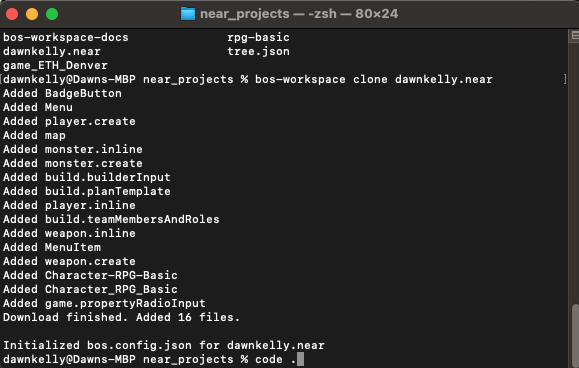
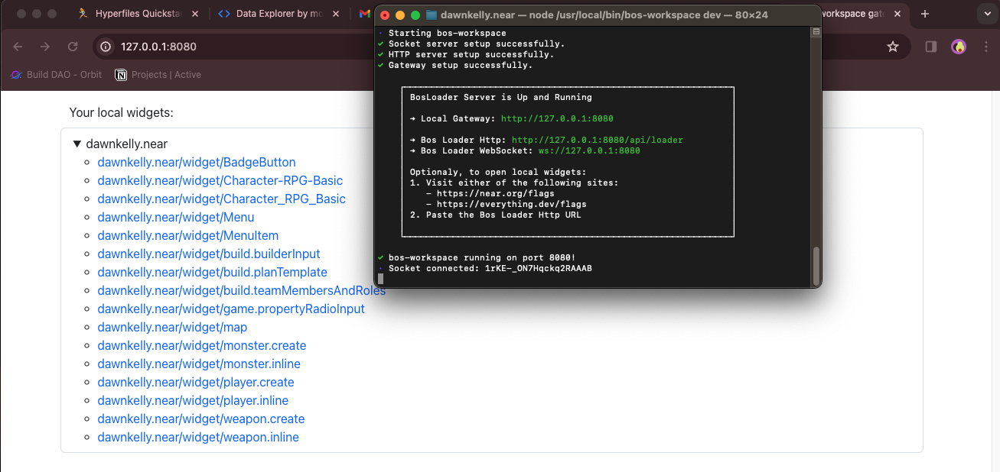
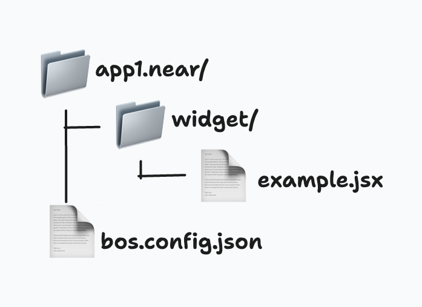
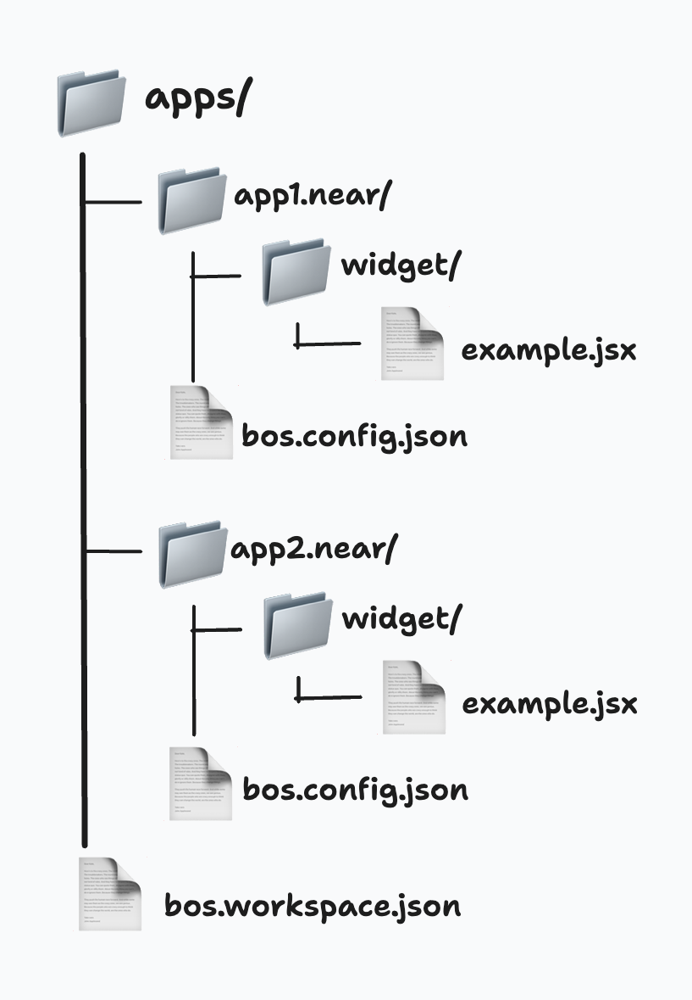

# bos-workspace

🕰️ **Legacy `bos-workspace` users can use the [migration guide](https://github.com/NEARBuilders/bos-workspace/blob/main/MIGRATION_GUIDE.md) to upgrade or read the legacy documentation for v0.0.1-alpha.6 [here](https://github.com/NEARBuilders/bos-workspace/tree/version/0.0.1-alpha.6).**

`bos-workspace` is a comprehensive toolset designed to simplify the development and deployment of [NEAR components](https://docs.near.org/bos/tutorial/quickstart) and applications. With support for hot reload, TypeScript, and multiple app management, it caters to developers looking for an efficient and scalable development environment.

## Quickstart

### Installation

You can install `bos-workspace` globally on your machine or within your existing project workspace using npm (or other package manager):

global install:
```js
npm -g install bos-workspace
```
or navigate to your project directory and install:
```js
npm install bos-workspace
```
To verify `bos-workspace` in installed, you can check for a current version:
```js
bos-workspace -V
```


To start, you may clone an existing project by navigating to your project directory and running the `clone` command:
```js
bos-workspace clone [accountId]
```
where `accountId ` is your named NEAR account (yourname.near)



In the terminal, navigate to the account name workspace, then run `bos-workspace-dev` to start the development server. 

The image below is an example of what your terminal and browser should look like once you've opened the local gateway.



### Usage

You can use your `bos-workspace` for both single and multi app development by taking advantage of the relationship between `Apps` and `Workspaces`

**App:** 
- belongs to an Account
- described by a `bos.config.json` where the content is:
```
{
    "account": "app.near"
}
```

- path to code: `{projectId}/widget/*`
- cloning: `bos-workspace clone {accountId}` to create an App with `bos.config.json` set up and pull in all of the widgets from that `accountId`

*Sample directory structure*



**Workspace**
- able to hold multiple Apps at the same time (similar to a monrepo) 
- described by a `bos.workspace.json` where the content is:
```
{
    "apps": ["/apps/*"]
}
```
*Sample directory structure*



*Note: App names are not required to end in `.near` or be stored in a directory named `/apps`. Be sure your `bos.config.json` is located at the same level as directories like `/widget` and your `bos.workspace.json` reflects the name of the directory where your apps are located*

### Commands

To see the list of commands, run `bw` or `bos-workspace`

